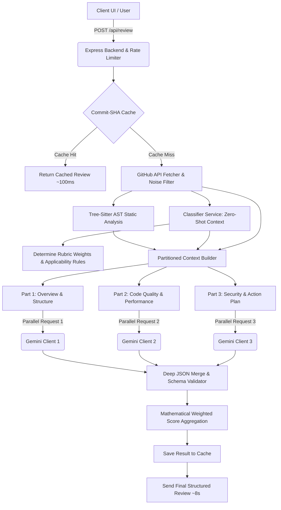

# RepooRoast Architecture & Deep Technical Design

This document details the internal architecture, mathematical algorithms, pipeline flows, and security boundaries of RepooRoast.

---

## 1. System Pipeline Architecture

RepooRoast operates on an asynchronous multi-stage evaluation pipeline combining deterministic local Abstract Syntax Tree (AST) parsing with zero-shot classification and parallel Generative AI synthesis.

---

## 2. Core Subsystems

### 2.1. Zero-Shot Repository Classification (`classifierService.js`)
Unlike standard code review tools that apply a monolithic rubric, RepooRoast classifies the repository type *before* static analysis and grading:
- **Input:** File tree (depth <= 3), `package.json` dependencies, `README.md`, and CI/CD indicator metrics.
- **Output:** Exact category type (`personal_portfolio`, `library`, `cli_tool`, `production_service`, `experimental_prototype`, `student_assignment`, `unknown`).
- **Purpose:** Injects a dynamic **Applicability Matrix** to suppress structurally irrelevant penalties (e.g., missing `SECURITY.md` or missing unit test coverage on a single-page personal portfolio).

### 2.2. Deterministic AST Static Analysis (`staticAnalyzer.js`)
- Uses **Tree-sitter WASM grammars** (`web-tree-sitter`) to parse JavaScript, TypeScript, TSX, and Python into concrete syntax trees.
- Extracts mathematical metrics:
  - Cyclomatic Complexity per function / branch
  - Maximum nesting depth
  - Function parameter counts
  - Magic number occurrences
  - Dependency graph (in-degree hub files, orphan files, and circular paths)
  - Comment-to-code ratios and TODO/FIXME markers

### 2.3. Parallel LLM Chaining (`geminiService.js`)
To overcome standard 25-30 second latency bottlenecks, prompts are decomposed into three independent payload parts:
1. **Overview & Structure:** Architecture, folder structure, documentation, high-level verdict.
2. **Code Quality & Performance:** AST metric interpretation, complexity flags, memory efficiency, scalability.
3. **Security & Fix Prompt:** Vulnerability detection, critical priorities, and CRED-structured AI auto-fix prompts.

All 3 requests execute concurrently across separate API clients (`Promise.all`), reducing generation time to **~8 seconds**.

### 2.4. Mathematical Score Aggregation
The overall score is not a subjective hallucination; it is computed mathematically via weighted linear combination:

$$\text{Final Score} = \frac{\sum_{i=1}^{n} (\text{CategoryScore}_i \times \text{Weight}_{\text{RepoType}, i})}{\sum_{i=1}^{n} \text{Weight}_{\text{RepoType}, i}}$$

Category weights are defined per repository classification in `rubric-weights.json`.

### 2.5. Intelligent Caching (`cacheService.js`)
- Keyed by `repo:${owner}/${repo}:${commitSha}` for full repositories and `diff:${owner}/${repo}:${headRef}` for Pull Requests.
- Serves verified identical commits in **~100ms** without consuming LLM API quota.

---

## 3. Security & Sandboxing Architecture

1. **Strict CORS Whitelisting:** The API rejects untrusted origins, restricting access to `https://repo-roast-ai.vercel.app/` and local development ports.
2. **Prompt Injection XML Fences:** Untrusted user code and repository files are isolated in `<repository_data>` and `<diff_data>` XML blocks. Strict overriding instructions follow the untrusted payload.
3. **Zero-Budget OOM Defense:** Files exceeding 50KB are filtered at the GitHub tree metadata stage before downloading.
4. **Rate Limiting:** IP-based throttles (`express-rate-limit`) protect backend resources against denial-of-service attempts.
