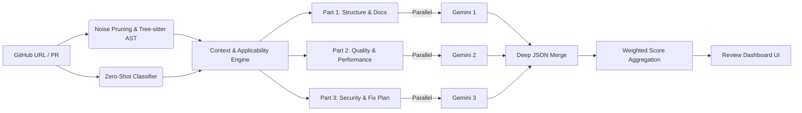

<div align="center">
  
  <h1>RepoRoast</h1>
  <p><strong>AI-powered code reviews backed by real static analysis — not just GPT with a pretty face.</strong></p>

  [](LICENSE)
  [](https://nodejs.org)
  [](server/tests/)
  [](CONTRIBUTING.md)

  [Live Demo](https://repo-roast-ai.vercel.app/) · [Architecture](ARCHITECTURE.md) · [Report Bug](https://github.com/Justinvcj/RepooRoast/issues) · [Request Feature](https://github.com/Justinvcj/RepooRoast/issues)
</div>

---

> Paste any GitHub repository URL or Pull Request link. Receive a brutally honest, data-backed code review in seconds.

## 💡 Why RepoRoast?

Most "AI code review" tools are thin wrappers that blindly dump raw code into an LLM prompt and hallucinate issues. RepoRoast works fundamentally differently:

1. **Runs real static analysis first:** Tree-sitter parses JS, TS, TSX, and Python into concrete syntax trees (ASTs). Cyclomatic complexity, nesting depth, parameter counts, magic numbers, and dependency import graphs are computed *locally* with zero hallucination.
2. **Classifies context before grading:** Evaluates whether a repository is a personal portfolio, open-source library, or production microservice. An intelligent **Applicability Matrix** suppresses irrelevant penalties (e.g. missing `SECURITY.md` on a student portfolio).
3. **The AI synthesizes verified facts, not raw noise:** Gemini receives structured AST metrics and token-budgeted source code. It scores categories against a strict **Anchor Grading Rubric** and fires across 3 parallel requests to finish in ~8 seconds.

---

## ⚡ How It Works



---

## ✨ Features

- **AST Static Analysis** — Parses JS, TS, and Python via Tree-sitter WASM grammars to measure cyclomatic complexity, nesting depth, and magic numbers per function.
- **Dependency Graph Mapping** — Identifies hub files (imported by many), orphan files (imported by none), and circular dependency chains.
- **Context-Aware Classification** — Detects project archetypes and applies type-specific grading weights and severity suppressions.
- **Parallel LLM Chaining** — Splits the review into 3 concurrent Gemini requests, dropping review times from ~25s to **~8s**.
- **Instant Response Caching** — Hashes reviews against verified `commitSha` metadata to serve repeat requests in **~100ms**.
- **PR & Diff Reviews** — Paste any Pull Request URL (`github.com/owner/repo/pull/1`) or `base...head` comparison for incremental diff auditing.
- **Auto-Fix Prompt Generator** — Crafts copy-pasteable, CRED-structured prompts ready for Claude, Cursor, or ChatGPT to fix every flagged vulnerability.
- **Fortified Security Defense** — Fences untrusted inputs inside `<repository_data>` tags, enforces strict CORS whitelisting, and applies zero-budget OOM protection against files >50KB.

---

## 🚀 Quick Start

### Prerequisites

| Requirement | Why It's Needed |
|---|---|
| [Node.js 18+](https://nodejs.org) | Runtime engine for client and server |
| [Gemini API Key](https://aistudio.google.com/apikey) | Powers the AI review synthesis (free tier supported) |
| [GitHub Token](https://github.com/settings/tokens) | *(Optional)* Increases GitHub API rate limits to 5,000 req/hr |

### Run Locally in 60 Seconds

```bash
# 1. Clone the repository
git clone https://github.com/Justinvcj/RepooRoast.git
cd RepooRoast

# 2. Setup and run Backend (Terminal 1)
cd server
npm install
cp .env.example .env
npm start
# Server starts on http://localhost:3001

# 3. Setup and run Frontend (Terminal 2)
cd ../client
npm install
npm run dev
# Client starts on http://localhost:5173
```

---

## ⚙️ Environment Variables

### Server (`server/.env`)

| Variable | Required | Default | Description |
|---|---|---|---|
| `GEMINI_API_KEY` | **Yes** | — | Primary Google AI Studio API key |
| `GEMINI_API_KEY_2` | No | — | Optional secondary key for parallel request pipelines |
| `GEMINI_API_KEY_3` | No | — | Optional tertiary key for parallel request pipelines |
| `GITHUB_TOKEN` | No | — | GitHub Personal Access Token (prevents API rate limits) |
| `PORT` | No | `3001` | Express server port |
| `NODE_ENV` | No | `development` | Runtime mode (`development` or `production`) |

---

## 🛠️ Tech Stack

| Layer | Technology |
|---|---|
| **Frontend** | React 19, TypeScript, Tailwind CSS, Framer Motion, Vite, OGL WebGL |
| **Backend** | Node.js, Express 5, Axios, Helmet, Morgan, Express-Rate-Limit |
| **Static Analysis** | `web-tree-sitter` (WASM grammars for JS, TS, TSX, Python) |
| **Token Optimization** | `gpt-tokenizer` (`cl100k_base` encoding) |
| **AI Backbone** | Google Gemini (with multi-model fallback chain) |
| **Testing** | Vitest with HTML reporting |

---

## 🧪 Testing

```bash
cd server
npm test
```

Tests validate Tree-sitter AST metric calculations, commit-SHA cache lifecycles, file noise pruning, JSON response parsing, and XML prompt injection boundaries.

---

## 📐 Architecture & System Design

For comprehensive details regarding AST traversal, mathematical scoring algorithms, and security sandboxing, see [ARCHITECTURE.md](ARCHITECTURE.md).

---

## 🤝 Contributing

Contributions are welcome! Please read [CONTRIBUTING.md](CONTRIBUTING.md) before submitting a pull request.

---

## 📄 License

This project is licensed under the [MIT License](LICENSE).

---

## 🙏 Acknowledgments

- [`web-tree-sitter`](https://github.com/tree-sitter/tree-sitter) for WASM AST parsing capabilities.
- [`Google Gemini`](https://ai.google.dev/) for high-throughput multimodal intelligence.
- [`gpt-tokenizer`](https://www.npmjs.com/package/gpt-tokenizer) for token budget allocation.
